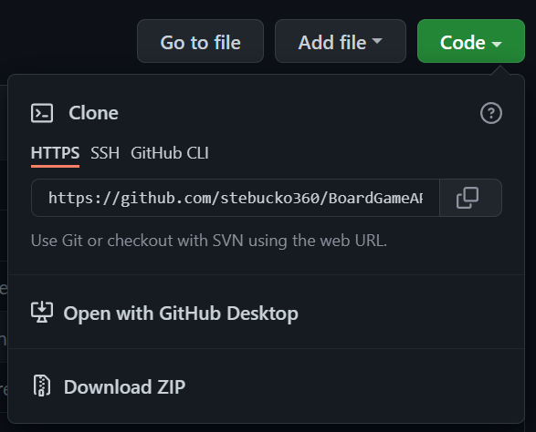
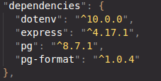

# Stephen Buckley's Board Game Review API

Welcome to my Boardgame Review API! Below you will find a link to the hosted version of this API and a set of instructions to allow you ease of access and navigation around the API.

This project was created to exhibit my abilities in creating a backend server with various endpoint and making queries using postgreSQL.

I am open to constructive feedback on this project so if you feel you have any insights into adapting/implenting this API feel free to get in contact.

This API demonstrates features such as:

-Queries
-Pagination
-GET, POST, PATCH, DELETE (See the hosted version below for the full list of endpoints; some examples are at the bottom of the README)
-Handling complex queries
-SQL Injection prevention
-TDD development focus

## Link to hosted version:

https://stephen-board-game-api.herokuapp.com/api

## Instructions for cloning/ installing dependencies/ seeding local database and running tests:

## Step 1: Cloning

In order to clone this repo:
- click the green 'code' button located at the top right of this page (if viewing in github via browser.)

-Using your devices terminal, enter the following using the copied url from the previous step; make sure you are in the directory you wish to clone this repo to!

-You will now be able to open this repo in your chosen code editor.

## Step 2: Installing dependencies

Find below the dependencies you require with instructions for installation:

Prequisites of running this code:

-Node.js
-Postgres

Use the terminal command 'npm install --prod' to install the following dependencies:

If you wish to be running tests you can just run 'npm install' to install all dependencies (including dev dependencies below:)

## Step 3: Seeding local database

You will need to create two .env files for this project: .env.test and .env.development. Into each, add PGDATABASE=nc_games (for .env.development) and PGDATABASE=nc_games_test (for .env.test). Double check that these .env files are .gitignored if you wish to push any changes to your forked version of this repo.

In order to use this API locally you will be required to seed the local database. This is a simple task; just run the following command in your terminal:

"npm run setup-dbs"
"npm run seed"

You should see the following in your terminal:

## Step 4: How to run tests

In order to run tests; as part of the dependency setup you will have had to install dev dependencies as this is includes the testing package 'jest'.

In your terminal run the command from the root of the repository " npm test ./\_\_tests\_\_/app.test.js"

## Examples of endpoints:

### GET:

/api = This will bring you to the main api route that will display a full list of potential endpoints available.

/api/categories = Responds with an array of category objects.

/api/reviews/:review_id = Responds with a review object specified by the :review_id provided.

/api/reviews = Responds with a reviews array, containing all review objects.

There are various queries available for this end point:
- sort_by = 'title', 'owner', 'review_id', 'category', 'review_img_url', 'created_at', 'votes', 'count'.
- order = asc or desc.
- category = Specify a boardgame category and have these results returned only.
-Pagination is now a feature of this end point. Use 'page' and 'limit' respectively to use this feature.

(All of the above queries have been coded to prevent SQL injection attacks)

/api/reviews/:review_id/comments = Responds with an array of comments for the provided review_id.

### PATCH:

/api/reviews/:review_id = Send an object in the form of {inc_votes: number}. This can both increment and decrement the value. This end point will respond with the patched review.

Any invalid key/value properties will be dealt with by the error handler and return the error.

### POST:

/api/reviews/:review_id/comments = Must send an object in the form of {username: 'string', body: 'string'}, will respond with the new comment object. 

Any invalid key/value properties will be dealt with by the error handler and return the error.

### DELETE:

/api/comments/:comment_id: Delete the requested comment with the corresponding comment_id. Will respond with '204'.
